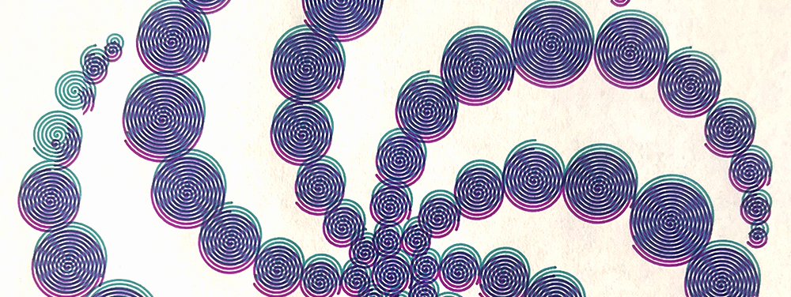
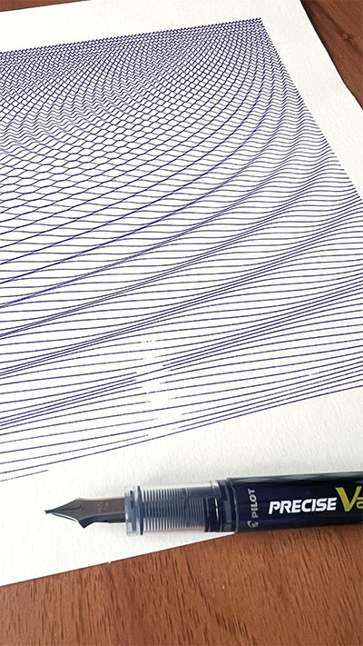

# quil-party
Doodling with the [Quil library](http://quil.info/) in Clojure



**Crop Circles** 2025

## Usage
- Jack-in using Leiningen
- sketches live in `./src/quil_party`
- Evaluate (q/defsketch) to open visualizer
- Mess around: update & eval code called by the draw loop, save svgs when it looks cool, etc

In order to call the functions directly in the REPL, they need to be wrapped with the current sketch:
```
(quil.applet/with-applet quil-party.basic-svg 
    (quil.core/no-loop)) ;; pause the draw loop

(quil.applet/with-applet quil-party.basic-svg 
    (quil.core/start-loop)) ;; restart the loop
```

## troubleshooting
### axidraw isn't drawing anything
- make sure you add a `stroke="black"` attribute on the top level `<g>` in your svg
- or figure out how to get q/create-graphics to do this



**Waveforms** 2025
